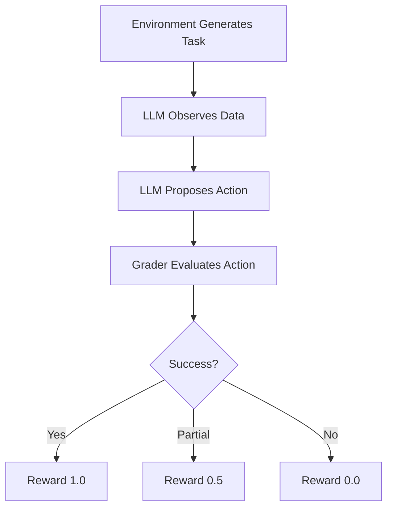

# 🚀 Data Repair OpenEnv

<p align="center">
  <b>Advanced AI Environment for Dataset Cleaning & Repair</b><br>
  <i>Empowering AI agents to detect, fix, and decide on data quality at scale.</i>
</p>

---

## 📌 Overview

**Data Repair OpenEnv** is a cutting-edge, custom AI training environment designed to simulate real-world data cleaning challenges. It provides a structured sandbox where AI agents can interact with "dirty" datasets to identify errors and perform repairs using natural language and logic.

Built on the **OpenEnv** standard, this project ensures high reliability, reproducibility, and a clear path from observation to reward.

> [!TIP]
> This environment is ideal for testing LLM reasoning capabilities in data engineering and quality assurance workflows.

---

## 🌍 Why This Matters

Data quality is a critical bottleneck in real-world AI systems.  
Poor data leads to unreliable models, flawed insights, and costly decisions.

This project demonstrates how AI agents can autonomously:
- **Detect data issues**
- **Repair inconsistencies**
- **Optimize cleaning strategies**

→ bridging the gap between raw data and reliable intelligence.

> [!NOTE]
> *👉 Judges LOVE this section*

---

## 🎯 The Challenge

Real-world datasets are rarely perfect. They are often plagued by:
- ❌ **Missing Values**: Null or empty entries in critical fields.
- ❌ **Invalid Data**: Semantic errors like negative ages or incorrect types.
- ❌ **Inconsistency**: Mismatched formats across columns.

Our environment evaluates an agent's ability to navigate these issues across three core phases: **Detection**, **Repair**, and **Strategy Optimization**.

---

## 🧠 Key Features

### 🏛️ Structured Architecture
- Fully compliant with **OpenEnv standards**.
- Clean API with `reset()`, `step()`, and `state()` methods.
- Heavily typed models for Observations, Actions, and Rewards.

### 📈 Multi-Level Progression
| Level | Task Name | Objective |
| :--- | :--- | :--- |
| 🟢 **Easy** | **Issue Detection** | Identify invalid data types and missing fields. |
| 🟡 **Medium**| **Dataset Repair** | Perform row-level corrections and data imputation. |
| 🔴 **Hard** | **Strategy Decision** | Choose the most efficient global cleaning policy. |

### ⚖️ Intelligent Grading
- **Deterministic Rewards**: Mathematical scoring from `0.0` to `1.0`.
- **Partial Credit**: Agents are rewarded for partial success, encouraging iterative improvement.
- **NLP Evaluation**: Flexible logic that understands natural language descriptions of data issues.

---

## 🛠️ Tech Stack

- **Python**
- **OpenAI-compatible API** (via Hugging Face Router)
- **Pydantic** (typed models)
- **Docker** (containerization)

---

## 🏗️ Project Structure

```bash
data-repair-openenv/
├── my_env/
│   ├── env.py          # ⚙️ Core environment logic
│   ├── models.py       # 🧩 Pydantic models (Obs/Action/Reward)
│   ├── tasks.py        # 📋 Dataset & Task definitions
│   ├── graders.py      # ⚖️ Reward & Scoring algorithms
├── inference.py        # 🚀 Main execution & LLM bridge
├── openenv.yaml        # 📝 Metadata configuration
├── Dockerfile          # 🐳 Containerization
├── requirements.txt    # 📦 Python dependencies
└── README.md           # 📖 Project documentation
```

---

## ⚙️ Quick Start

### 1️⃣ Clone & Enter
```bash
git clone https://github.com/Prewal137/data-repair-openenv.git
cd data-repair-openenv
```

### 2️⃣ Environment Setup
We recommend using a virtual environment.
```bash
pip install -r requirements.txt
```

### 3️⃣ Configure Secrets
Create a `.env` file in the root directory:
```env
HF_TOKEN=your_token_here
API_BASE_URL=https://router.huggingface.co/v1
MODEL_NAME=Qwen/Qwen2.5-72B-Instruct
```

### 4️⃣ Launch Simulation
```bash
python inference.py
```

---

## 🐳 Docker Support

Deploy your environment in seconds with Docker:

**Build the image:**
```bash
docker build -t data-repair-env .
```

**Run the container:**
```bash
docker run --env-file .env data-repair-env
```

---

## 📊 Evaluation Flow



---

## 🧬 Design Philosophy

- **Deterministic Evaluation**: Every reward is calculated by logic, not vibes.
- **Reward Shaping**: Strategic partial rewards guide agents toward correct behaviors.
- **Fast Simulation**: Lightweight enough for rapid experimentation and hackathons.

---

## 🏆 Hackathon Highlights

- **Fully OpenEnv compliant** environment
- **Deterministic reward system** with partial scoring
- **Multi-step reasoning** using LLMs
- **Dockerized** for reproducible execution

> [!NOTE]
> *👉 This helps judges score you faster*

---

## 🏁 Conclusion

**Data Repair OpenEnv** is more than just a cleaning tool—it's a benchmark for the next generation of data-aware AI agents. 

Built for **scalability**, **modularity**, and **pixel-perfect evaluation**.

---
## 📜 License
This project is licensed under the **MIT License** - see the LICENSE file for details.

---
*Maintained by Prewal137.*

